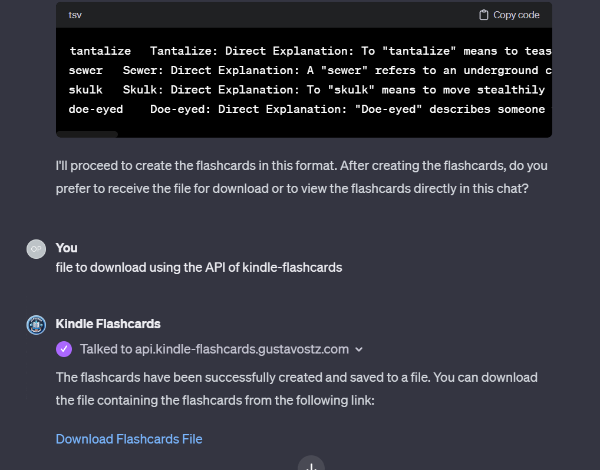
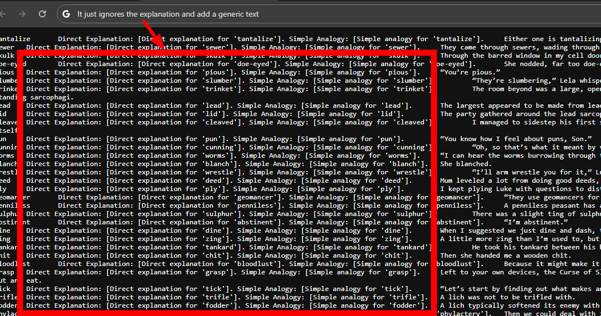

# Kindle Flashcards 📚

Create automatic flashcards from your Kindle vocabulary builder using AI and export into Anki.

## Table of Contents
- [Introduction](#introduction)
- [Features](#features)
- [Workflow Overview](#workflow-overview)
- [Detailed Steps](#detailed-steps-)
- [Instructions Categories](#instructions-categories) 
  - [Direct Explanations](#direct-explanations)
    - [English](#english-)
    - [Japanese](#japanese-)
    - [Spanish](#spanish-)
  - [Funny Explanations](#funny-explanations)
    - [English](#english-)
- [Deck Templates Categories](#deck-templates-categories)
  - [ANKI Default Templates](#anki-default-templates)
  - [ANKI Custom Templates](#anki-custom-templates)
- [Guidelines Categories](#guidelines-categories)
  - [ChatGPT](#chatgpt)
- [Video Tutorial](#video-tutorial-)
- [Community Contributions](#community-contributions)
- [License](#license)
- [Acknowledgements](#acknowledgements)
- [FAQ](#faq-)


## Introduction
This repository is dedicated to integrating the capabilities of GPT for generating personalized Anki flashcards, aiming to subtly improve your learning experience. It's a place where technology meets practicality, providing a simple yet effective way to utilize your Kindle's vocabulary for flashcard creation. To start interacting with Kindle Flashcards via ChatGPT, visit [Kindle Flashcards GPT](https://chat.openai.com/g/g-9wKfpW66j-kindle-flashcards).

> [!NOTE]  
> ⚠️ Project integration is currently exclusive to ChatGPT, requiring ChatGPT Plus for access. ⚠️

Words and contexts are extracted from your Kindle's `vocab.db` file, allowing GPT to create targeted, effective flashcards.

If you find this project helpful, please consider giving it a ⭐️ on GitHub. Your support is greatly appreciated and it helps keep the project alive and evolving!

## Features
- **Kindle Vocabulary Extraction**: Seamlessly pull words and contexts from your Kindle's `vocab.db`.
- **GPT-Powered Flashcard Generation**: Utilize GPT's advanced capabilities for personalized flashcard creation.
- **Community-Powered Instruction Repository**: Access and contribute to a rich library of instructions, guidelines, and deck templates.
- **Anki Integration**: Directly prepare and import generated flashcards into Anki or other flashcard applications.

## Workflow Overview
1. **Extract Vocabulary**: Interface with the Kindle's `vocab.db` to pull vocabulary words and contexts.
2. **Instruction Retrieval**: Access community-contributed instructions for flashcard creation.
3. **DeckTemplate Retrieval**: Access community-contributed DeckTemplates for preparing flashcards to import into Anki.
4. **Flashcard Generation**: Craft personalized flashcards leveraging user instructions and extracted data.
5. **Flashcard Export**: Prepare flashcards for Anki import or receive them directly through chat.

## Detailed Steps 👣

> [!NOTE]  
> If you encounter any difficulties during these steps, watch the [Video Tutorial](#video-tutorial-) which will show you how to do it.

### Step 0: Kindle Connection
- Connect your Kindle to your desktop and search for the `vocab.db` file.

### Step 1: Extraction of Information from `vocab.db`
- Drag the vocab.db file to the [Kindle Flashcards GPT](https://chat.openai.com/g/g-9wKfpW66j-kindle-flashcards) chat and send it.

### Step 2: Selecting a Book
- The GPT will ask you to select a book from the list of books that you have on your Kindle.
- Select the book that you want to generate flashcards from.

### Step 3: Selecting the Instructions
- The GPT will show you a list of words on their contexts, and will ask you about instructions on how to generate the flashcards.

#### Option 1: Send Instructions through Chat
- You can send instructions directly through the chat guiding him what he should do with the words and contexts.

#### Option 2 (Recommended): Send Instructions ID through Chat
- You can send an instruction ID (for example, 0001) or the instruction ID with the full name (for example, 0001-Direct-and-analogy-explanations-in-English), and the GPT will retrieve the instruction from the Kindle Flashcards GPT API and proceed accordingly.
- The GPT will ask your permission to get the instruction from the API, just allow it:


##### Common questions in this part:

1. **How do I know which instruction ID to use?**
    - You can check the [Instructions Categories](#instructions-categories) to see the list of instructions, what they do, and their IDs.
2. **How do I add my own instruction?**
    - You can open a pull request in this repository with your instruction, just follow the [contribution guidelines](CONTRIBUTING.md).
    - After accepting your pull request, your instruction will be automatically available for everyone to use.


### Step 4: Importing Flashcards into Anki (Selecting DeckTemplate)

#### Option 1: Generate flashcards through Chat
- If you only desired to generate the flashcards through the chat, you already accomplished your goal.
- Now ChatGPT is accessing your vocab.db file on each iteration and plotting new flashcards based on the instructions that you sent.
- You can continue asking him to generate more flashcards with new words and context from your `vocab.db` file.

#### Option 2: Generate flashcards ready to import into Anki
- After selecting the instructions, the GPT will generate for you the flashcards using the instructions that you selected and prompt on the chat. But probably your main intention here is to import the flashcards into Anki, right?
- So, even if it's not prompted, you can send 'DeckTemplate: {ID}', replacing {ID} with the DeckTemplate ID you wish to use for import into ANKI. You can check all the Deck Templates available here: [Deck Templates Categories](#deck-templates-categories).
- Now, he's putting your flashcards in the format that you want to import into Anki.
- After this, there are several options that he can ask you. But it's important to be direct and clear that you want him to import the flashcards into Anki and for this you want to download the file through the Kindle Flashcards API:



- Now you have two options, ask him to add more words with its context and explanations to the flashcards or ask him to download the file through the Kindle Flashcards API.

> [!NOTE]  
> ChatGPT can be inconsistent at times, so it's always recommended to verify the file's accuracy before performing multiple iterations of adding more words.

- If you want to add more words and context to the flashcards, simply instruct, 'Please add more words with their contexts and explanations from this vocab.db file,' and it will append more flashcards to the file within the Kindle Flashcards API.
- If you want to download the file, you can ask the link for him. And if you're not being able to click on the link, you can get your link in this way: 
```
api.kindle-flashcards.gustavostz.com/download/{fileName}
```


- Or you can simply ask him to give you the link in plain text:


- And now you can just import this file into Anki:


##### Common questions in this part:

1. **What is a Deck Template?**
    - A Deck Template specifies the format that ChatGPT should follow when generating flashcards. It ensures consistency and compatibility with your flashcard application. Explore the various Deck Templates available in our [Deck Templates Categories](#deck-templates-categories). 
2. **Can I create my own Deck Template?**
    - Absolutely! Similar to instructions, you can contribute your Deck Template by opening a pull request in this repository. Check the [contribution guidelines](CONTRIBUTING.md) for more details.
3. **Why do I need to use the Kindle Flashcards API to download the file?**
    - While it's not a 'necessity', we strongly recommend using the Kindle Flashcards API for file downloads. ChatGPT has a limited context window, which might lead to issues, especially with larger files. The API helps mitigate such risks and ensures a smoother experience. Here's an example of what can happen when dealing with large files directly through ChatGPT:
    

### Final Step: Warnings and Recommendations
- **Recommendation**: The file generated by the Kindle Flashcards API is a temporary file, it will be deleted after some time. So, if you want to keep the file, you should download it and save it in your computer.
- **Warning**: **DO NOT** use any personal information in the flashcards, because the file generated by the Kindle Flashcards API is public and anyone can access it.

## [Instructions](frontend/instructions) Categories

### Direct Explanations:

#### English 🍔
- [0001 - Direct and analogy explanations](frontend/instructions/0001-Direct-and-analogy-explanations-in-English)
- [0002 - Direct explanations](frontend/instructions/0002-Direct-explanations-in-English.md)

#### Japanese 🍣

- [0003 - Direct explanations](frontend/instructions/0003-Direct-explanations-in-Japanese.md)

#### Spanish 💃

- [0005 - Direct explanations](frontend/instructions/0005-Direct-explanations-in-Spanish.md)

### Funny Explanations:

#### English 🍔

- [0004 - Humorous explanations](frontend/instructions/0004-Humorous-Explanations-English.md)

## [Deck Templates](frontend/deckTemplates) Categories

### ANKI Default Templates:

- [0002 - Anki Basic TSV](frontend/deckTemplate/0002-Anki-basic-template.md)
- [0003 - Cloze Anki TSV](frontend/deckTemplate/0003-Cloze-Anki-template.md)

### ANKI Custom Templates:

- [0001 - Word + Definition + Context - TSV](frontend/deckTemplate/0001-Word-Definition-Context-template.md)

## [Guidelines](frontend/deckTemplates) Categories (AI)

### ChatGPT

- [0001 - Get Vocab, Book, Words, Instructions, DeckTemplate, then generate flashcards as the user wants](AI/GPT/0001-Guidelines.md)

## Video Tutorial 🎥
Watch our tutorial to engage with the system more effectively:

[](https://youtu.be/rKEa5SfOOuU)

## Community Contributions
Kindle Flashcards thrives on community involvement. Contributions extend beyond code to include:
- **Instructions**
- **Deck Templates**
- **Guidelines**

Contribute or utilize these resources to enrich your learning and the collective knowledge base.

Your insights and improvements are always welcome! Just ensure that you follow the naming convention and [contribution guidelines](CONTRIBUTING.md).


## License
This project is proudly open-sourced under the [MIT License](LICENSE).

## Acknowledgements
Heartfelt thanks to all contributors and users for their invaluable support and feedback. Your contributions continuously enrich this project ❤️.

## FAQ 🤔

<details>
  <summary> What's the difference between Instructions and Deck Template?</summary>
    Both are guidelines that the ChatGPT will use to generate the flashcards, but the Instructions will be used to form the explanation of the flashcards and the Deck Template will be used to format the flashcards to import into specific platforms like Anki.
</details>

<details>
  <summary>What is the purpose of the 'Guidelines' files in the AI folder?</summary>
    <p>The 'Guidelines' files are essentially sets of instructions for GPT, detailing how it should behave at each step. They represent the specific configuration of GPT within ChatGPT for this project.</p>
    <p>You are welcome to create your own set of guidelines and apply them to our GPT; it will follow to your instructions. This allows flexibility and customization in the way the GPT works for your specific needs.</p>
    <p>If you think your own guideline adds any value, feel free to submit a pull request to include it in the repository. Outstanding contributions might even become the new default guideline for the Kindle Flashcards GPT, enhancing the project for all users!</p>
</details>


<details>
  <summary>Can I use this project without ChatGPT Plus?</summary>
  Currently, the project integration is exclusive to ChatGPT, and it requires ChatGPT Plus for access. But if another AI company comes to the market with a free GPT/plugin store, we would be eager to integrate with them.
</details>

<details>
  <summary>Can I use this app to import in other flashcard app?</summary>
  YES! Thinking on this we designed the deckTemplates, you can create your own deckTemplate and import the flashcards in any flashcard app that you want.
</details>

<details>
  <summary>How do I contribute to the project?</summary>
  You can contribute by submitting pull requests, suggesting new features, or enriching our repository of instructions, deck templates, and guidelines. Please ensure you follow our contribution guidelines.
</details>

<details>
  <summary>I couldn't find an appropriate category for my Instructions/Guidelines/Deck Template. What should I do?</summary>
  Be creative! If you have a new idea, feel free to create a new category. Just ensure that you follow the naming convention and contribution guidelines.
</details>